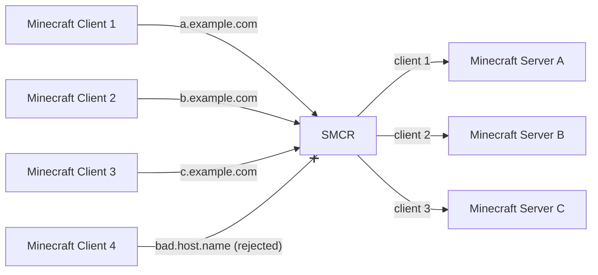

# SMCR: Simple Minecraft Router

[](http://www.gnu.org/licenses/gpl-3.0.html)
[](https://github.com/Fallen-Breath/smcr/issues)
[](https://hub.docker.com/r/fallenbreath/smcr)

A simple Minecraft router that routes using the server address in the [handshake](https://wiki.vg/Protocol#Handshake) packet

With SMCR, you can connect to multiple Minecraft servers with only 1 port,
which is helpful if you don't want to expose too many ports, 
or you're using reversed proxy like [frp](https://github.com/fatedier/frp) that only provides a few ports



## Similar projects

There are some similar projects that provides better support on metrics / high availability, go check them out:

- https://github.com/itzg/mc-router
- https://github.com/haveachin/infrared

## Usages

Prepare your config file, then you can start SMCR with the following command

```bash
./smcr  # use ./config.yml as the configuration
./smcr -c /path/to/config.yml  # explicitly supply the path to the config

# declare config content in environment variable SMCR_CONFIG (yaml format)
export SMCR_CONFIG='{"listen": "0.0.0.0:7777", "routes": [{"name": "default", "matches": ["example.com"], "target": "127.0.0.1:25565"}]}'
./smcr
```

### Config Examples

An example config file with all available options can be found [here](config.example.yml)

Here's some useful config examples for lazyman

A basic connection forwarder that to ensure the client connects with `example.com`

```yaml
listen: 0.0.0.0:7777
routes:
  - name: example
    matches:
      - example.com
    target: 127.0.0.1:25565
```

A config with more routes defined

```yaml
listen: 0.0.0.0:7777
routes:
  - name: svr1
    matches:
      - svr1.example.com
    target: 127.0.0.1:10000
    
  - name: svr2
    matches:
      - svr2.example.com
    target: 127.0.0.1:20000

  - name: svr3
    matches:
      - svr3.example.com
    target: 127.0.0.1:30000
```

A connection forwarder that modifies the server address in the handshake packet from whatever value to `mc.example.com:25565`.
Notes that the only route in the config has the name `default`, so all client connections will be handled by this route

```yaml
listen: 0.0.0.0:7777
routes:
  - name: default
    target: server.example.com:20001
    mimic: mc.example.com:25565
```

A connection forwarder that has a server address check, and will append a proxy protocol header to the downstream target server

```yaml
listen: 0.0.0.0:7777
routes:
  - name: example
    matches:
      - 127.0.0.1
      - example.com:20001
    target: 127.0.0.1:25577
    proxy_protocol: 2
```

## Config Entries

Here's a detailed explanation of all options in the config file

### General options

#### listen

The address where SMCR listens on

Example: `120.0.0.1:6666`, `0.0.0.0:7777`, `:8888`

```yaml
listen: 0.0.0.0:7777
```

#### debug

The debug switch of SMCR. Set to true to enable debug level logging and log caller will be included in the log

```yaml
log_level: false
```

#### routes

Route definition. It's an object list where each item represents a route

See [section route](#route) for explanation on route items

```yaml
routes:
  - name: example
    matches:
      - localhost:7777
    target: 127.0.0.1:25565
```

#### srv_lookup_timeout

The timeout for querying an SRV record

See section [timeout format section](#timeout-format) for more details on its format

```yaml
srv_lookup_timeout: 3s
```

#### default_connect_timeout

The timeout for connect to a route target

You can set a lower timeout for fast response, if SMCR and the target server is in the same LAN

See section [timeout format section](#timeout-format) for more details on its format

```yaml
default_connect_timeout: 3s
```

#### proxy_protocol

Enable support for accepting proxy protocol from client

When enabled, client connections are required to send a proxy protocol header (in either version 1 or 2) to smcr

```yaml
proxy_protocol: false
```

### Route

When received a client connection, SMCR will try to read the [handshake packet](https://wiki.vg/Protocol#Handshake) from the client and extract the hostname + port from it.

#### name

The name of the route

```yaml
name: foo
```

#### matches

A list of address which this route will accept

SMCR will check if any of these addresses matches the hostname and port in client's handshake packet

There are 2 valid formats for the address
1. Hostname with port, e.g. "localhost:7777", "127.0.0.1:7777", "mc.example.com:7777", which matches the both the hostname of the port
2. Hostname only, e.g. "localhost", "mc.example.com", which matches the hostname only

The hostname-with-port match has a higher priority than the hostname-only match,
so if you have 2 matching routes, where one uses hostname with port and the other uses hostname only,
the route will the port will get the match, no matter what the route order in the routes list is

```yaml
matches:
  - localhost:7777
  - 127.0.0.1:7777
  - mc.example.com
```

#### action

Optional option, define what SMCR will do with this route for the client connection

| action    | explanation                                              |
|-----------|----------------------------------------------------------|
| `forward` | Accept the connection and forward it to the given target |
| `reject`  | Simply close the connection                              |

The default value is `forward`

```yaml
action: forward
```

#### reject_message

*Available when `reject` is `true`*

Optional option, the message to be sent back to the client as the disconnect reason

If not given, SMCR will just close the connection directly

See [mc message section](#mc-message-format) for more details on its format

```yaml
reject_message: 404 not found
```

#### target

*Available when `reject` is `false`*

Required, The address of the target server that SMCR will forward the client connection to

If the port is absent, SMCR will try to perform an SRV lookup on the given hostname.
If SRV lookup fails, port 25565 will be used as the fallback value

```yaml
target: 127.0.0.1:25565
```

#### mimic

*Available when `reject` is `false`*

Optional option. If given, SMCR will modify the hostname and port in the handshake packet

It should be an address with hostname and port

It can be used to bypass the handshake address check on the actual Minecraft server

```yaml
mimic: mc.hypixel.net:25565
```

#### timeout

*Available when `reject` is `false`*

Optional, the maximum timeout for connecting to the target server.

If not given the value from [default_connect_timeout](#defaultconnecttimeout) will be used

See section [timeout format section](#timeout-format) for more details on its format

```yaml
timeout: 5s
```

#### dial_fail_message

*Available when `reject` is `false`*

Optional option, the message to be sent back to the client if smcr fails to connects to the target server

If not given, SMCR will just close the connection directly

See [mc message section](#mc-message-format) for more details on its format

```yaml
dial_fail_message: server down?
```

#### proxy_protocol

*Available when `reject` is `false`*

If given, send proxy protocol header to the target server using given version (1 or 2)

```yaml
proxy_protocol: 2  # using version 2
```

### Default route

A route named `default` is the default route, which works as a fallback route for the unmatched client connections.
It accepts all client connections, only when other routes fail to match client's connecting address

The `matches` field of the default route is ignored

Here's some example default routes:

```yaml
# Reject with message
name: default
action: reject
reject_message: '{"text": "oops", "color": "red"}'
```

```yaml
# Route to given target
name: default
target: localhost:20000
```

If there's no default route in the config, unmatched client connections will be simply discard, 
just like a default route with reject action and no reject message

### Field formats

#### timeout format

It's string that represents a time duration format. Examples:

```yaml
example_timeout1: 1.5s
example_timeout2: 300ms
```

The value should greater than `0`. Zero or negative values are treated as unset values

See https://pkg.go.dev/time#ParseDuration for more details

#### mc message format

It's a string that represents a Minecraft message component

If the given input is a valid json string, then SMCR will just the given value directly as the message json.
Notes that the json object in the string should satisfy [Minecraft's json text format](https://minecraft.fandom.com/wiki/Raw_JSON_text_format)

```yaml
example_message1: '{"text": "hello world", "color": "green"}'
example_message2: '"foobar"'
```

Otherwise, SMCR will treat the given input as a plain string, and convert it into a valid message json

```yaml
example_message3: this is a plain text
# SMCR will use "this is a plain text" as the message json
```

## Docker

The docker image of SMCR is released at [DockerHub](https://hub.docker.com/repository/docker/fallenbreath/smcr)

You can run SMCR with the following command

```bash
docker run -p 7777:7777 -v ./config.yml:/app/config.yml fallenbreath/smcr:latest
```

You can also use [the example docker-compose.yml](docker/docker-compose.yml) as an example `docker-compose.yml` file to run SMCR
